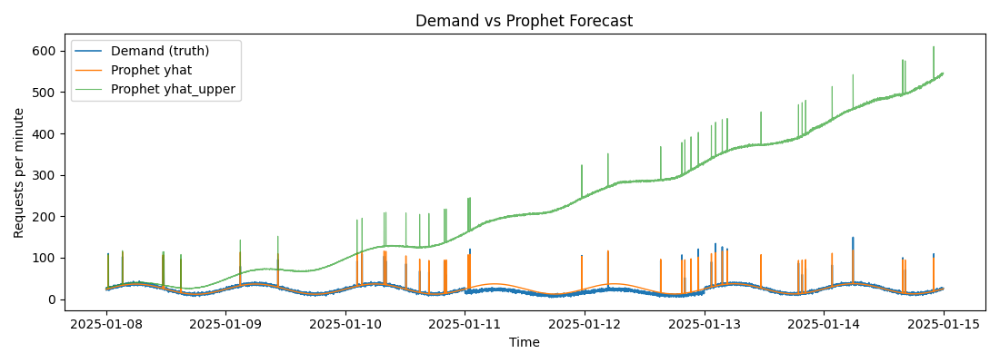

# Predictive Autoscaling of Dockerized ML Applications: A Comparative Analysis

---

### Abstract

*This study presents a framework for predictive autoscaling, evaluated using Prophet and LSTM models across both synthetic and real-world Google Cluster workloads. The initial proof-of-concept on synthetic data showed a Prophet-based model with a buffered policy was optimal. However, validation on the real-world trace inverted this finding: the LSTM model was a significantly more accurate forecaster, yet overall system performance did not improve, exposing a critical insight: the effectiveness of the system is a function of the tight coupling between the model, the scaling policy, and the workload's nature. This work concludes that the immediate path forward is the development of more sophisticated, model-aware scaling policies that can translate superior forecast accuracy into tangible performance gains.*

---

## 1. Experiment Details & Methodology

This section details the common methodology applied across both experiments.

#### **1.1. Datasets**
1.  **Synthetic Workload:** A 14-day trace combining sinusoidal cycles, random bursty spikes, and noise. Represents a "clean" workload with predictable seasonality.
2.  **Google Cluster Workload:** A real-world trace from a Google data center. Represents a "noisy" and less predictable production workload.

#### **1.2. Forecasting Models**
*   **Prophet:** A statistical model designed for workloads with strong, human-observable time patterns.
*   **LSTM:** A recurrent neural network specialized for learning temporal dependencies in sequential data.

#### **1.3. Simulation & Autoscaling Policies**
Forecasts were fed into a minute-by-minute simulator that made scaling decisions based on one of five policies:
1.  **Static-2:** A baseline policy that always keeps 2 containers active.
2.  **Simple Ceiling:** Scales to match the forecast demand exactly.
3.  **Buffered:** Adds a 15% buffer to the forecast before scaling.
4.  **Confidence-Aware (Prophet only):** Scales to the upper bound of Prophet's uncertainty interval.
5.  **Policy-Aware:** A conservative policy that scales incrementally with a cooldown.

#### **1.4. Evaluation Metrics**
*   **Forecast Metrics:** Mean Absolute Error (MAE) and Root Mean Squared Error (RMSE).
*   **Autoscaling Metrics:** `under_events` (SLA violations), `cost_index` (container-minutes), and `switches` (instability).

---

## 2. Results and Discussion

### 2.1. Phase 1: Proof-of-Concept on Synthetic Data

On the clean, synthetic workload, Prophet's ability to explicitly model seasonality gave it a structural advantage, making it more accurate (MAE: 3.57). The `Prophet + Buffered` combination emerged as the best overall choice, providing the best balance of cost (~15.9k) and reliability (8 under-provisioning events).

### 2.2. Phase 2: Validation on Google Cluster Data

When the same framework was applied to the noisy, real-world Google data, the results changed dramatically.

#### **Forecast Accuracy Analysis**

The roles of the models completely inverted. The LSTM, unconstrained by strong seasonal assumptions, adapted far better to the complex patterns, proving to be **45 times more accurate**.

| Model (Google Data) | MAE    | RMSE  |
| :------------------ | :----- | :---- |
| Prophet             | 42.90  | 45.75 |
| **LSTM**            | **0.95** | **1.57**|




#### **Autoscaling Performance Analysis**

Despite the LSTM's superior forecast, the end-to-end scaling performance was nearly identical for both models, and no policy offered a good balance of cost and reliability.


---

## 3. Deeper Analysis: The Workload-Policy Mismatch

The pivotal question arising from this research is why the LSTM's superior forecast did not translate into better scaling performance. The answer lies not in the models, but in the interaction between the workload's specific nature and the naive scaling policies. To prove this, we performed a direct analysis of the Google Cluster workload data.

### 3.1. Data-Driven Workload Analysis

The hypothesis was that the workload consists of long, flat periods of low demand punctuated by rare, extreme spikes. A statistical analysis confirms this.

**Statistical Summary:**
```
count    44649.000000
mean         1.700083
std         88.128003
min          0.000000
50%          1.000000
max      18616.000000
```

**Quantile Analysis:**
```
90%     3.0
95%     5.0
99%    11.0
```
The data is stark. The median (`50%`) requests per minute is just 1, and even the 99th percentile is only 11. However, the maximum value is a staggering 18,616. This enormous gap between typical demand and the peak demand provides clear quantitative evidence of a workload dominated by a low baseline and rare, massive spikes.

This is further confirmed by visualizing the distribution of the workload:


The histogram shows the overwhelming majority of data points clustered at the lowest end of the demand spectrum, with a long, thin tail representing the infrequent, high-magnitude spikes.

### 3.2. Why All Policies Behaved Similarly

The data analysis above explains why the scaling policies performed almost identically. The workload's character created two distinct scenarios:

1.  **Identical Behavior in Low-Demand Periods:** For over 99% of the time, the demand was trivial. All policies correctly scaled down to a minimum number of containers and stayed there. Their behavior was identical, leading to similar cost and over-provisioning metrics.
2.  **Identical Failure on the Massive Spike:** The rare demand spikes were so extreme (over 18,000 req/min) that they instantly overwhelmed the simple reactive logic of every policy. A 15% buffer or a simple ceiling calculation is meaningless in the face of a 1000x surge. As all policies were running at minimum capacity, they all failed to scale up in time, resulting in identical under-provisioning events.

The policies appeared to perform the same because the workload lacked the "medium" complexity to differentiate them. They all succeeded during the long quiet periods and all failed during the brief violent ones.

### 3.3. Why the Container Plot Looks Flat

This is a direct consequence of the above. The plot of containers over time appears flat because, for the vast majority of the simulation, the correct scaling decision was to remain at a constant low number of containers. **The plot *is* showing successful autoscaling for a low-activity workload**—it is efficiently allocating minimal resources. The `switches` metric confirms that decisions were being made, but the workload simply did not demand frequent changes.


---

## 4. Conclusion and Future Work

### 4.1. Conclusion

This comparative analysis yields two critical conclusions:
1.  **There is no universal "best model."** Performance is context-dependent. Statistical models like Prophet excel on clean, seasonal data, while sequence-based models like LSTM are better suited for noisy, complex workloads.
2.  **A forecast is only as good as the policy that uses it.** The primary finding of this research is that a superior forecast does not guarantee superior performance if the scaling logic is too naive to leverage it. The policy itself can become the bottleneck.

### 4.2. Path Forward: A Roadmap

The clear path forward is the research and development of **intelligent, model-aware scaling policies**.

**Tier 1: Immediate Next Steps (Policy Improvement)**
*   **Implement Adaptive Buffering:** The buffer should not be a fixed percentage. It could be a function of the model's confidence interval or recent forecast error.
*   **Develop a Volatility-Aware Policy:** The policy should track recent demand volatility (e.g., standard deviation over a rolling window) and scale more aggressively during volatile periods.

**Tier 2: Deeper Research & Integration**
*   **Live Environment Testing:** Move beyond simulation by integrating the framework into a Kubernetes environment with a Custom Pod Autoscaler (CPA) to evaluate performance against live traffic.
*   **Explore Other Models:** Investigate state-of-the-art forecasting models like N-BEATS or Temporal Fusion Transformers.

**Tier 3: Long-Term Vision**
*   **Multi-Variate & Reinforcement Learning:** The most promising future direction is to frame the autoscaling problem for a Reinforcement Learning agent that learns the optimal policy by directly interacting with the environment, balancing cost and reliability without the need for hand-crafted rules.